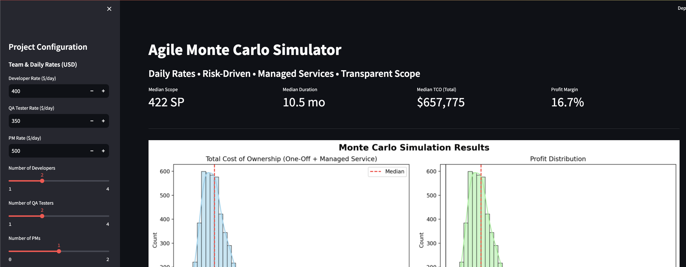

#  Agile Monte Carlo Simulator

A lightweight, browser-based tool for simulating software project costs, timelines, and profitability using **Monte Carlo methods**. Built with **HTML, JavaScript, and Chart.js**, this tool helps agile teams make data-driven decisions under uncertainty — no installation, no Python, no backend required.

Perfect for:
- Project scoping
- Bid pricing
- Risk analysis
- Client proposals
- Internal planning

**[Live Demo](https://yourusername.github.io/agile-monte-carlo-simulator)** (tbc)

---

## Screenshot

> *Interactive dashboard showing cost, profit, duration, and risk distributions.*

---

## 🔧 Features

 **Runs entirely in the browser** – just open the `.html` file  
 **No dependencies** – works offline  
 **Real Monte Carlo simulation** (1,000–10,000 iterations)  
 **Interactive inputs** with sliders and real-time feedback  
 **Visual outputs**:
- Total Cost of Ownership (TCO)
- Profit distribution
- Duration forecast
- Profit margin
 **Risk modeling** for:
- Uncertain scope
- Variable team velocity
- Hidden bugs (rework)
- Changing priorities
 **Managed service costs** (optional ongoing support as % of one-off cost)
 **Cloud infrastructure toggle** (IaaS/PaaS optional)
 **Export results to CSV**✅ **Clear sprint estimation**: "X SP ≈ Y sprints ≈ Z months"

---

##  How It Works

The simulator runs thousands of possible project outcomes by varying key uncertain factors:

| Input | Distribution |
|------|--------------|
| Scope | Triangular + drift (from changing priorities) |
| Velocity | Normal (mean = 20 SP/sprint, std dev from risk) |
| Rework | Beta + exponential (driven by bug risk) |
| Costs | Daily rates × duration |
| Managed Service | Optional % of one-off cost (annual) |

After simulation, it provides:
- **P50, P80, P90 estimates** for cost and time
- **Profitability chance**
- **Sensitivity insights**

This helps you **quote confidently**, **plan for risk**, and **optimize team structure**.

---

##  How to Use

### Option 1: Open in Browser (Recommended)
1. Download [`monte-carlo.html`](monte-carlo.html)
2. Double-click to open in any browser (Chrome, Firefox, Edge, etc.)
3. Adjust inputs in the sidebar
4. Click **"Run Monte Carlo Simulation"**
5. View charts, metrics, and download results

>  No internet required after download!

### Option 2: Host Online (e.g., GitHub Pages)
1. Push this repo to GitHub
2. Go to **Settings > Pages**
3. Set source to `main` branch, `/root`
4. Visit `https://<your-username>.github.io/<repo-name>`

---

##  Inputs Explained

| Parameter | Description |
|---------|-------------|
| **Daily Rates** | Cost per day for Dev, QA, PM (adjust for onsite/offshore) |
| **Expected Scope (SP)** | Total story points. 20 SP ≈ 1 sprint (2 weeks) |
| **Risk: Uncertain Scope** | Initial ambiguity in requirements |
| **Risk: Variable Team Speed** | Sprint velocity fluctuation |
| **Risk: Hidden Bugs** | Technical debt, defects, rework effort |
| **Risk: Changing Priorities** | Mid-project scope growth |
| **Cloud IaaS/PaaS** | Optional monthly cloud cost range |
| **Managed Service** | Ongoing support as % of initial project cost |
| **Number of Simulations** | 1K–10K runs for accuracy |

---

##  Outputs

| Metric | Description |
|-------|-------------|
| **Median Scope** | Most likely final scope in SP |
| **Median Duration** | Expected timeline in months |
| **Median TCO** | Total Cost of Ownership (one-off + managed service) |
| **Profit Margin** | Estimated margin (with 20% markup) |
| **P80 TCO** | Budget to be 80% confident of staying under |
| **Chance of Profit** | Probability of making money |
| **P90 Duration** | Timeline to be 90% confident of meeting |

---

##  Export Results

Click **"Download Results (CSV)"** to get a CSV file with:
- Duration
- TCO (one-off and total)
- Profit
- Profit margin
- Scope and sprints

Useful for reporting, audits, or further analysis in Excel.

---

## 📂 Project Structure
profile
Qwen3-235B-A22B-2507
3:20 pm
Absolutely! Below is a professional, comprehensive README.md file for your GitHub repository. It’s designed to clearly explain your Agile Monte Carlo Simulator — whether you're sharing it with colleagues, clients, or the open-source community.

📄 README.md – Agile Monte Carlo Simulator
markdown

65
66
67
68
69
70
71
72
73
74
75
76
77
78
79
80
81
82
83
84
85
86
87
88
89
90
91
92
93
94
95
96
97
98
99
100
101
102
103
104
105
106
107
108
109
110
111
112
113
114
115
116
117
118
119
120
121
122
123
124
125
126
127
128
129
130
131
⌄
⌄
⌄
⌄
⌄
⌄
⌄
⌄

---

## 🚀 How to Use

### Option 1: Open in Browser (Recommended)
1. Download [`agile-cost-estimator-montecarlo.html](agile-cost-estimator-montecarlo.html)
2. Double-click to open in any browser (Chrome, Firefox, Edge, etc.)
3. Adjust inputs in the sidebar
4. Click **"Run Monte Carlo Simulation"**
5. View charts, metrics, and download results

> 💡 No internet required after download!

### Option 2: Host Online (e.g., GitHub Pages)
1. Push this repo to GitHub
2. Go to **Settings > Pages**
3. Set source to `main` branch, `/root`
4. Visit `https://<your-username>.github.io/<repo-name>`

---

##  Inputs Explained

| Parameter | Description |
|---------|-------------|
| **Daily Rates** | Cost per day for Dev, QA, PM (adjust for onsite/offshore) |
| **Expected Scope (SP)** | Total story points. 20 SP ≈ 1 sprint (2 weeks) |
| **Risk: Uncertain Scope** | Initial ambiguity in requirements |
| **Risk: Variable Team Speed** | Sprint velocity fluctuation |
| **Risk: Hidden Bugs** | Technical debt, defects, rework effort |
| **Risk: Changing Priorities** | Mid-project scope growth |
| **Cloud IaaS/PaaS** | Optional monthly cloud cost range |
| **Managed Service** | Ongoing support as % of initial project cost |
| **Number of Simulations** | 1K–10K runs for accuracy |

---

##  Outputs

| Metric | Description |
|-------|-------------|
| **Median Scope** | Most likely final scope in SP |
| **Median Duration** | Expected timeline in months |
| **Median TCO** | Total Cost of Ownership (one-off + managed service) |
| **Profit Margin** | Estimated margin (with 20% markup) |
| **P80 TCO** | Budget to be 80% confident of staying under |
| **Chance of Profit** | Probability of making money |
| **P90 Duration** | Timeline to be 90% confident of meeting |

---

## 📥 Export Results

Click **"Download Results (CSV)"** to get a CSV file with:
- Duration
- TCO (one-off and total)
- Profit
- Profit margin
- Scope and sprints

Useful for reporting, audits, or further analysis in Excel.

---

## 📂 Project Structure

agile-monte-carlo-simulator/

├── agile-cost-estimator-montecarlo.py 

├── agile-cost-estimator-montecarlo.html

├── README.md #

├── screenshot.png 

└── LICENSE 

